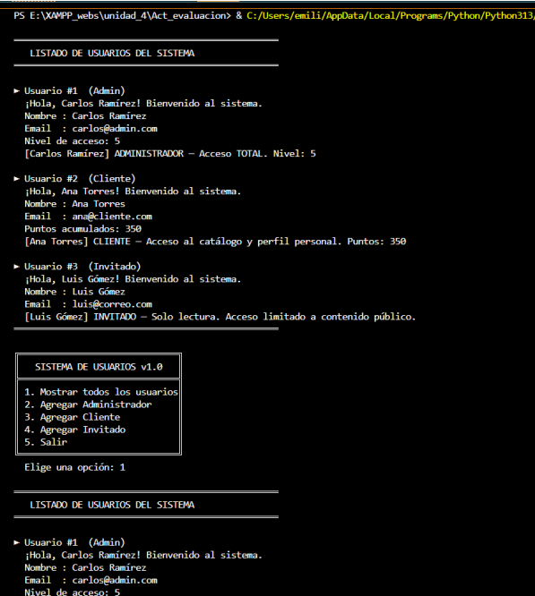
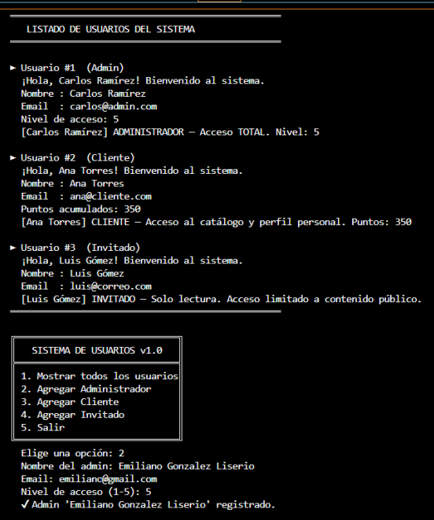
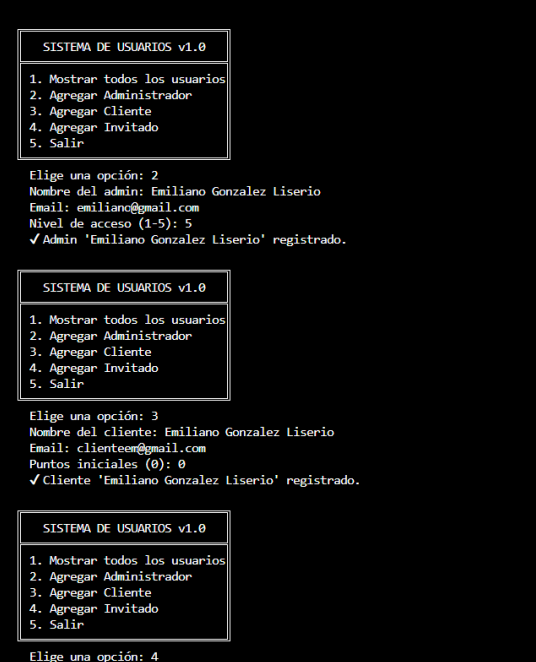
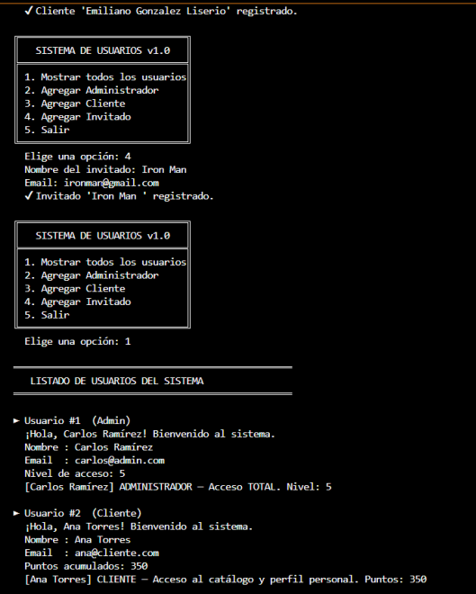
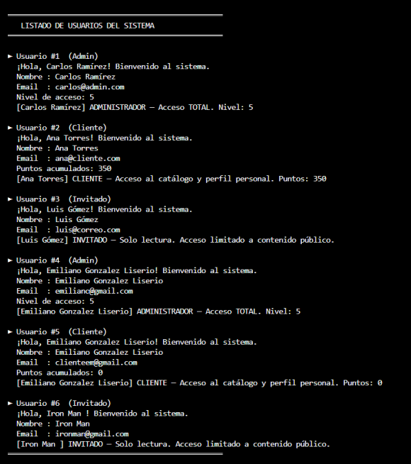
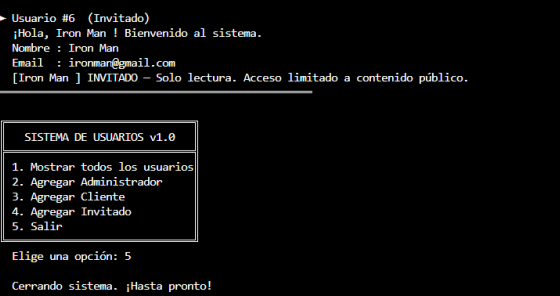

# 1. Nombre del proyecto
Sistema de Usuarios con Roles en Python

# 2. Objetivo del proyecto
Implementar un sistema de gestión de usuarios por consola aplicando los cuatro pilares fundamentales de la Programación Orientada a Objetos (POO).

# 3. Problema que resuelve
El código soluciona la necesidad de controlar el nivel de acceso a un sistema dependiendo del tipo de perfil (Administrador, Cliente o Invitado), asegurando que los datos ingresados, como el correo electrónico o los puntos acumulados, tengan un formato válido antes de registrarse.

# 4. Tecnologías utilizadas
* Python 3.x
* Módulo `re` (Expresiones Regulares)

# 5. Conceptos aplicados (según temario)
* Clases y Objetos
* Herencia (Clase base `Usuario` y clases derivadas)
* Polimorfismo (Diferentes comportamientos al listar usuarios)
* Sobrescritura de métodos (`acceso_sistema()`)
* Manejo de Excepciones (`try-except`, `ValueError`)

# 6. Capturas de pantalla

# 7. Instrucciones de ejecución
1. Abrir una terminal de comandos (CMD).
2. Navegar hasta la carpeta `codigo` de este proyecto.
3. Ejecutar el archivo principal con el comando: `python main.py`
4. Seguir las instrucciones del menú interactivo en consola.

# 8. Reflexión personal
* **¿Qué aprendí?** Comprendí cómo la herencia evita repetir código mediante la función `super()` y cómo el polimorfismo permite que una misma función actúe diferente según el objeto.
* **¿Qué fue difícil?** Implementar correctamente las validaciones, especialmente asegurar que el programa no se detuviera abruptamente al ingresar un tipo de dato incorrecto, sino que lanzara la excepción adecuada.
* **¿Qué mejoraría?** Agregaría persistencia de datos (guardar los usuarios en un archivo .txt o JSON) para que no se borren al cerrar el programa.