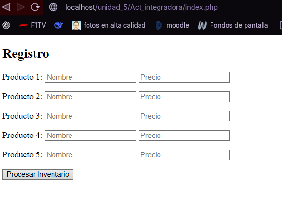
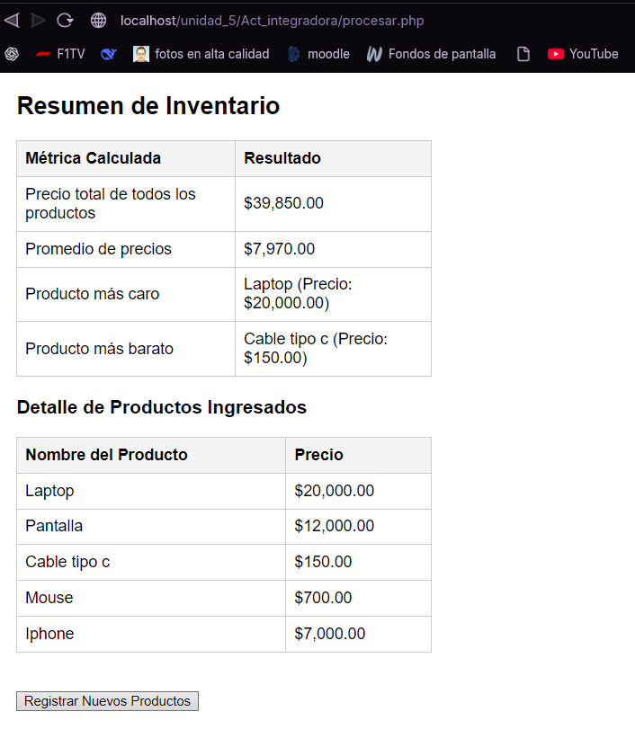

# 1. Nombre del proyecto
Sistema de Registro de Inventario

# 2. Objetivo del proyecto
Desarrollar una interfaz dinámica capaz de capturar múltiples productos y procesar los datos para obtener métricas clave del inventario.

# 3. Problema que resuelve
Automatiza el cálculo matemático de un lote de productos, obteniendo de manera inmediata el valor total del inventario, el promedio de precios y detectando cuáles son los productos más caros y más baratos sin necesidad de hacerlo manualmente.

# 4. Tecnologías utilizadas
* PHP 8+
* HTML5

# 5. Conceptos aplicados (según temario)
* Manejo de Arreglos Paralelos
* Envío de datos por método HTTP POST (`$_POST`)
* Funciones nativas de arreglos (`array_sum`, `max`, `min`, `array_search`)
* Estructuras de control y bucles iterativos (`for`)

# 6. Capturas de pantalla

# 7. Instrucciones de ejecución
1. Copiar la carpeta en el directorio `htdocs`.
2. Iniciar el servicio Apache en XAMPP.
3. Abrir el navegador e ingresar a: `http://localhost/Act_integradora/codigo/index.php`
4. Llenar los 5 campos y presionar "Procesar Inventario".

# 8. Reflexión personal
* **¿Qué aprendí?** Aprendí a enviar múltiples datos a la vez desde un formulario HTML creando un arreglo directamente en el atributo `name` (ej. `name="productos[]"`).
* **¿Qué fue difícil?** Sincronizar los índices de los arreglos paralelos; es decir, asegurar que el índice del precio máximo correspondiera exactamente al índice del nombre de ese producto.
* **¿Qué mejoraría?** En lugar de usar arreglos paralelos, crearía una clase `Producto` y manejaría un solo arreglo de objetos, lo que haría el código más robusto y fiel a la POO.