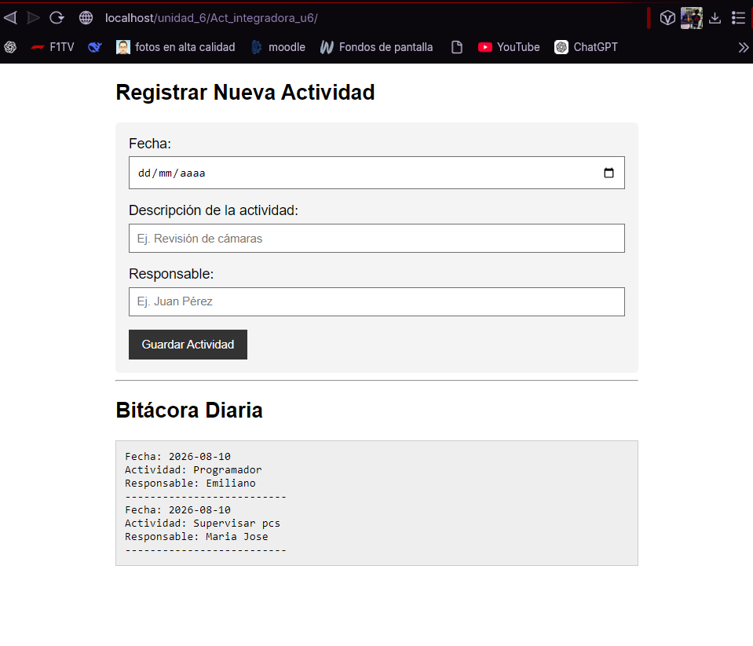
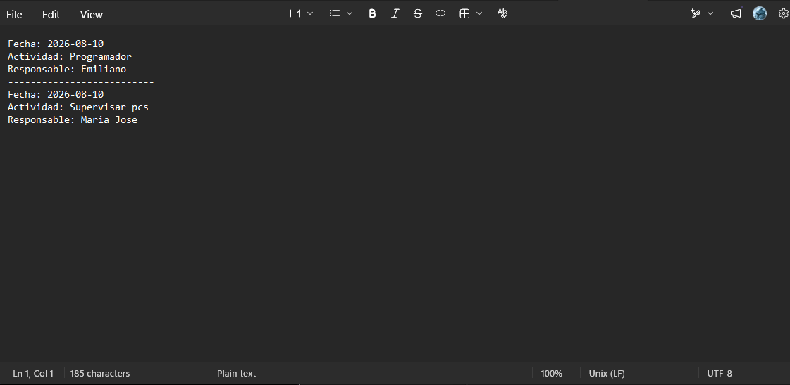

# 1. Nombre del proyecto
Bitácora de Actividades Persistente

# 2. Objetivo del proyecto
Crear un sistema de registro de incidencias o actividades que guarde la información de manera persistente en el servidor.

# 3. Problema que resuelve
Permite mantener un historial de actividades guardado permanentemente en un archivo de texto plano, resolviendo además el problema del reenvío accidental de datos cuando un usuario recarga la página.

# 4. Tecnologías utilizadas
* PHP 8+
* HTML5 y CSS3

# 5. Conceptos aplicados (según temario)
* Manipulación de archivos de texto (`file_put_contents`, modo `FILE_APPEND`)
* Bloqueos de archivo para seguridad (`LOCK_EX`)
* Patrón de diseño PRG (Post/Redirect/Get)
* Validación de datos vacíos (`empty`)

# 6. Capturas de pantalla

# 7. Instrucciones de ejecución
1. Copiar la carpeta en `htdocs`.
2. Iniciar Apache en XAMPP.
3. Asegurarse de que PHP tenga permisos de escritura en la carpeta para poder crear/editar el archivo `bitacora.txt`.
4. Abrir en el navegador: `http://localhost/Act_integradora_u6/codigo/index.php`

# 8. Reflexión personal
* **¿Qué aprendí?** Aprendí a leer y escribir archivos físicos en el servidor usando PHP, y descubrí el patrón PRG para evitar que los navegadores pregunten si se desea "reenviar el formulario" al actualizar la página.
* **¿Qué fue difícil?** Comprender el concepto de los bloqueos de archivo (`LOCK_EX`) y por qué son necesarios para evitar corrupción de datos si dos usuarios guardan al mismo tiempo.
* **¿Qué mejoraría?** Agregaría una función en la misma página para leer el archivo `bitacora.txt` e imprimir las actividades registradas en una tabla HTML de forma visual.