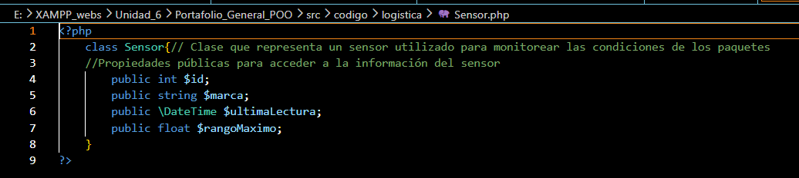
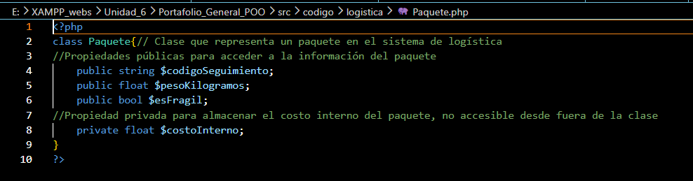
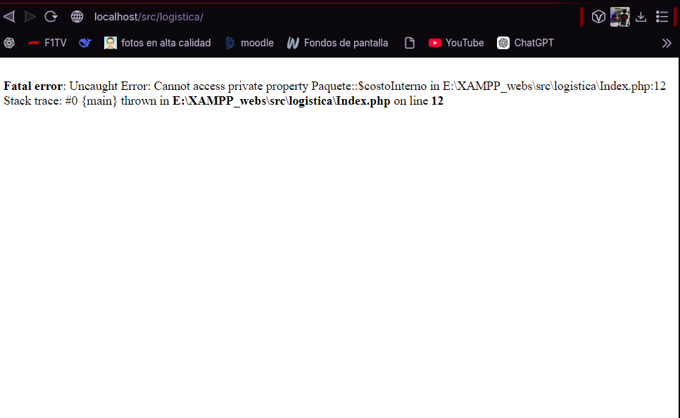

# 1. Nombre del proyecto
Modelo de Logística de Paquetes

# 2. Objetivo del proyecto
Modelar las entidades físicas de un sistema de logística de envíos mediante código orientado a objetos.

# 3. Problema que resuelve
Establece una estructura de datos segura y organizada para manejar la información de los paquetes (peso, seguimiento, fragilidad) y de los sensores que los monitorean, separando la información pública de la confidencial.

# 4. Tecnologías utilizadas
* PHP 8+

# 5. Conceptos aplicados (según temario)
* Abstracción y creación de Clases (`Paquete`, `Sensor`)
* Modificadores de acceso (Public y Private) para Encapsulamiento
* Inclusión de archivos externos (`require_once`)
* Instanciación múltiple de objetos

# 6. Capturas de pantalla

# 7. Instrucciones de ejecución
1. Copiar la carpeta del proyecto en `htdocs` de XAMPP.
2. Iniciar Apache en XAMPP.
3. Abrir el navegador e ingresar a: `http://localhost/src/codigo/Index.php`

# 8. Reflexión personal
* **¿Qué aprendí?** Entendí la importancia de los modificadores de acceso; pude comprobar mediante un error forzado por qué no se debe acceder a una propiedad `private` desde fuera de su clase.
* **¿Qué fue difícil?** Comprender cómo interactúan diferentes archivos de clases en PHP sin que el código se rompa por no encontrarlos.
* **¿Qué mejoraría?** Agregaría métodos *Getters* y *Setters* para poder manipular la propiedad privada `costoInterno` de forma segura.