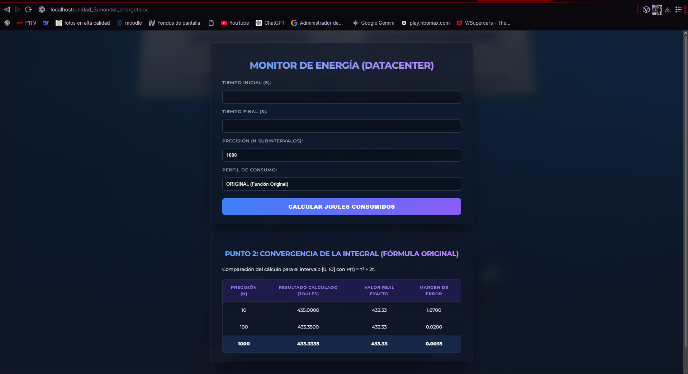
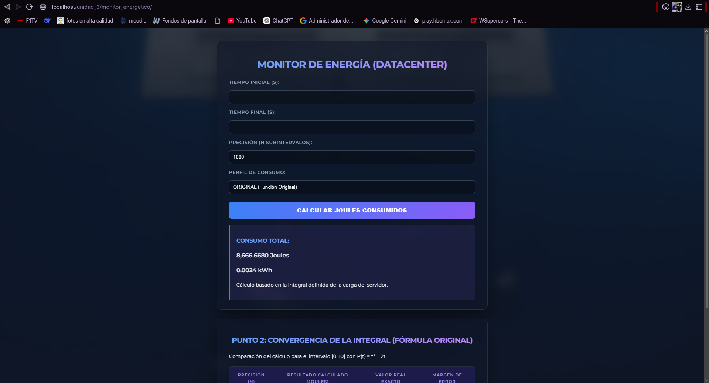

# 1. Nombre del proyecto
Monitor Energético para DataCenter (Cloud Energy Monitor)

# 2. Objetivo del proyecto
Desarrollar una aplicación web que calcule el consumo energético simulado de un servidor o centro de datos utilizando el método matemático de integración numérica.

# 3. Problema que resuelve
Permite estimar el gasto de energía (en Joules y su conversión a kWh) basándose en diferentes perfiles de consumo del servidor (Reposo, Promedio, Estrés), facilitando proyecciones de costos energéticos.

# 4. Tecnologías utilizadas
* PHP 8+
* HTML5 y CSS3

# 5. Conceptos aplicados (según temario)
* Creación de Clases e Instanciación (`IntegradorNumerico`)
* Definición de propiedades y métodos privados/públicos (Encapsulamiento)
* Uso de Namespaces
* Manejo de Excepciones (`try-catch`)

# 6. Capturas de pantalla

# 7. Instrucciones de ejecución
1. Copiar la carpeta del proyecto dentro del directorio `htdocs` de XAMPP.
2. Iniciar el servicio de Apache en el panel de control de XAMPP.
3. Abrir un navegador web y escribir en la barra de direcciones: `http://localhost/monitor_energetico/codigo/index.php`

# 8. Reflexión personal
* **¿Qué aprendí?** Aprendí a estructurar la lógica matemática dentro de una clase de PHP y a utilizar namespaces para mantener el código ordenado y evitar choques de nombres.
* **¿Qué fue difícil?** Traducir la fórmula de integración numérica a código y estructurar el ciclo para que calculara correctamente el área bajo la curva de la función de potencia.
* **¿Qué mejoraría?** Implementaría una gráfica dinámica (por ejemplo, con Chart.js) para visualizar la curva de consumo a lo largo del tiempo ingresado.